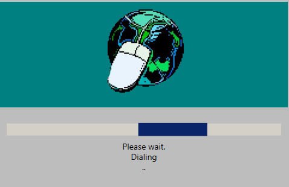

# DumbDialUp

Do you miss the nostalgia of beep boop beep boop cshhhhhh bzzzz bing bing crrrrrrrr dial-up?  

Well now you don't have to!  

## What?
When run, *DumbDialUp* will disable your internet connection until it has finished "dialing up".  
(Only tested on Ethernet connections but SHOULD work elsewhere, lemme know via an issue if you have any, well issues...)  

If you hold **LEFT SHIFT** when starting it will toggle start on boot, hold LEFT SHIFT again when starting to disable it or you can manually delete it from "Task Scheduler" in Windows.

## Usage
- Download the ZIP file from [the releases section](https://github.com/FuzzyTekShow/DumbDialUp/releases/tag/main).
- Extract it somewhere
- Run the EXE file (Holding LEFT SHIFT as it starts will toggle starting on boot)
- beep boop beep boop cshhhhhh bzzzz bing bing crrrrrrrr

## License
[MIT](https://choosealicense.com/licenses/mit/)